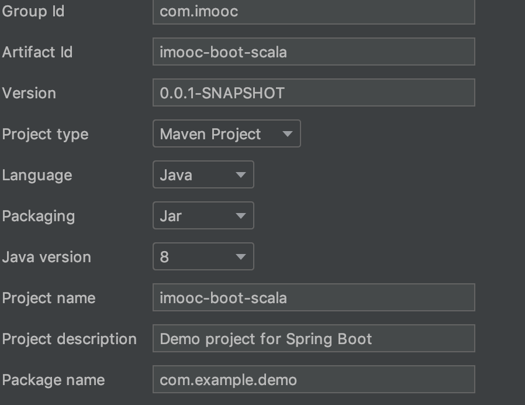
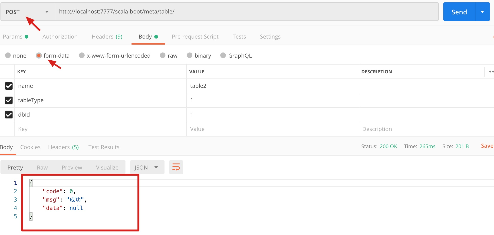
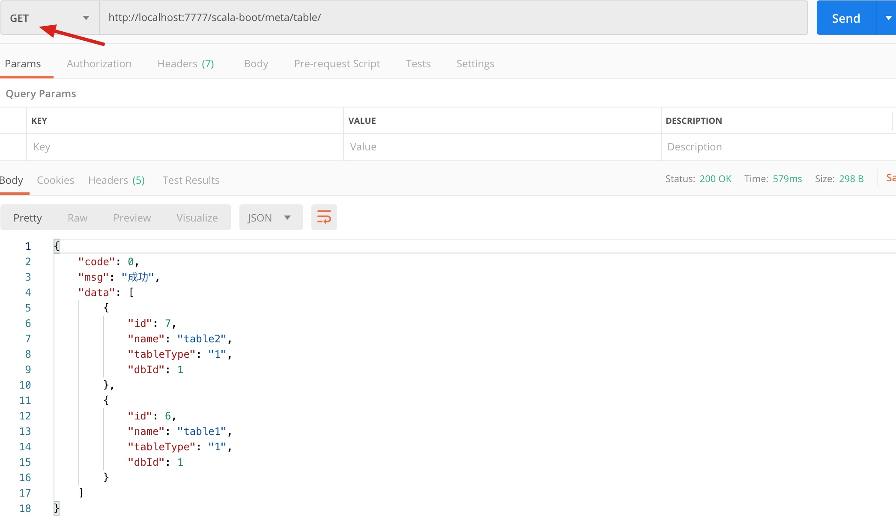

开发环境搭建：参考：https://www.bilibili.com/video/BV19E411x74H?p=13

Scala: Spring Boot+Spring Data JPA + Scala +java混编

# 统一元数据管理

 采集：flume+kafka

维护

元数据：

1.  稽查
2. 分析

本项目实战：

   1. 数据库管理：default imook-db1

      id 

      name

      Location: 文件系统上的目录 

      Java语言实现

   2. 表管理：imooc-table1

      id

      name

      tableType:表类型。内部表/外部表

      dbId

      默认存储路径： db对应location/tableName

      scala语言实现

# 搭建开发环境

## 搭建springboot环境




钩上web模块后，finish

项目构建完成后，把application.properties文件替换为application.yml文件

## 整合springboot和scala

Pom.xml里添加scala依赖

```xml
	<dependency>
			<groupId>org.scala-lang</groupId>
			<artifactId>scala-library</artifactId>
			<version>${scala.version}</version>
		</dependency>
```

再添加scala的插件

```xml
 						
	<plugin>
				<groupId>net.alchim31.maven</groupId>
				<artifactId>scala-maven-plugin</artifactId>
				<version>3.2.2</version>
				<executions>
					<execution>
					<id>compile-scala</id>
					<phase>compile</phase>
						<goals>
							<goal>add-source</goal>
							<goal>compile</goal>
						</goals>
					</execution>

					<execution>
						<id>test-compile-scala</id>
						<phase>test-compile</phase>
						<goals>
							<goal>add-source</goal>
							<goal>testCompile</goal>
						</goals>
					</execution>
				</executions>
				<configuration>
					<recompileMode>incremental</recompileMode>
					<scalaVersion>${scala.version}</scalaVersion>
					<args>
						<arg>-deprecation</arg>
					</args>
					<jvmArgs>
						<jvmArg>-Xms64m</jvmArg>
						<jvmArg>-Xmx1024m</jvmArg>
					</jvmArgs>
				</configuration>
			</plugin>
```


application.yml:

```yaml
server:
  port: 7777
  servlet:
    context-path: /scala-boot
```

### 测试一下

创建scala源码目录，写一个scala语言实现的controller，写一个controller

```scala
package com.imooc.controller  //要注意，要能被扫描到哦

import org.springframework.web.bind.annotation.{RequestMapping, RequestMethod, RestController}

@RestController
class ScalaHelloBoot {
   @RequestMapping(value = Array("sayScalaHello"),method = Array(RequestMethod.GET))
    def sayScalaHello()={
      "Hello Scala Boot"
  }
}

```

浏览器访问`http://localhost:7777/scala-boot/sayScalaHello`

输出Hello Scala Boot为测试通过

## 整合jpa

添加jpa的依赖

```xml
		<dependency>
			<groupId>org.springframework.boot</groupId>
			<artifactId>spring-boot-starter-data-jpa</artifactId>
			<version>2.2.5.RELEASE</version>
		</dependency>
		<dependency>
			<groupId>mysql</groupId>
			<artifactId>mysql-connector-java</artifactId>
			<version>8.0.19</version>
		</dependency>
```

配置数据源,application.yml内容：（事先建好数据库imoocbootscala）

```yaml
server:
  port: 7777
  servlet:
    context-path: /scala-boot

spring:
  datasource:
    driver-class-name: com.mysql.jdbc.Driver
    username: root
    password:
    url: jdbc:mysql://localhost:3306/imoocbootscala
  jpa:
    hibernate:
      ddl-auto: update
    database: mysql
```

## 数据库管理功能开发

管理功能使用Java开发，建立domain、repository、service目录

### 数据库实体

```java
@Entity
@Table   //表名生成： 大写变小写，除第一个外，小写后前面加一个_
public class MetaDatabase {
    @Id             //主键id
    @GeneratedValue //自增字段
    private Integer id;
    private String name;
    private String location;
```


### repository层

只要继承一个repository接口即可

```java
package com.imooc.repository;

import com.imooc.domain.MetaDatabase;
import org.springframework.data.repository.CrudRepository;

public interface MetaDatabaseRepository extends CrudRepository<MetaDatabase,Integer> {
}

```


### serivce层

```java
package com.imooc.service;

import com.imooc.domain.MetaDatabase;
import com.imooc.repository.MetaDatabaseRepository;
import org.springframework.beans.factory.annotation.Autowired;
import org.springframework.stereotype.Service;
import org.springframework.transaction.annotation.Transactional;

@Service
public class MetaDatabaseService {
    //私有repository属性
    @Autowired   //首先要把dao层自动注入进来
    private MetaDatabaseRepository metaDatabaseRepository;


    @Transactional //涉及到数据库事物
    public void save(MetaDatabase metaDataBase) {
        metaDatabaseRepository.save(metaDataBase);
    }

    public Iterable<MetaDatabase> query() {
        Iterable<MetaDatabase> metadatabases= metaDatabaseRepository.findAll();
        return metadatabases;
    }
}

```


### 单元测试

测试类一般放到test目录里，加入junit依赖

```xml
        <dependency>
            <groupId>junit</groupId>
            <artifactId>junit</artifactId>
            <version>4.13</version>
        </dependency>
```

**主要是两个注解**

```java
@RunWith(SpringRunner.class)
@SpringBootTest
```


测试类

```java
package com.imooc.service;

import com.imooc.domain.MetaDatabase;
import org.junit.Test;
import org.junit.runner.RunWith;
import org.springframework.beans.factory.annotation.Autowired;
import org.springframework.boot.test.context.SpringBootTest;
import org.springframework.test.context.junit4.SpringRunner;

@RunWith(SpringRunner.class)
@SpringBootTest
public class MetaDatabaseServiceTest {
    @Autowired
    MetaDatabaseService metaDatabaseService;

    @Test
    public void saveTest() {
        MetaDatabase metaDataBase = new MetaDatabase();
        metaDataBase.setName("default");
        metaDataBase.setLocation("localhost:8020/user/hive/warehouse");
        metaDatabaseService.save(metaDataBase);
    }
}

```

### controller开发

```java
package com.imooc.controller;

import com.imooc.domain.MetaDatabase;
import com.imooc.service.MetaDatabaseService;
import org.springframework.beans.factory.annotation.Autowired;
import org.springframework.web.bind.annotation.ModelAttribute;
import org.springframework.web.bind.annotation.RequestMapping;
import org.springframework.web.bind.annotation.RequestMethod;
import org.springframework.web.bind.annotation.RestController;

@RestController
@RequestMapping("/meta/database")
public class MetaDatabaseController {
    @Autowired
    private MetaDatabaseService metaDatabaseService;

    @RequestMapping(value = "/",method = RequestMethod.POST)
    public String save(@ModelAttribute MetaDatabase metaDatabase) {
        metaDatabaseService.save(metaDatabase);
        return "成功";
    }
}

```

<font color=red>注意点：</font>

1. controller注解的写法，先写controller(目的是加入spring容器)再写requestmapping
2. 上述例子里，url后面要加上/


#### 错误记录

controller报错The DispatcherServlet configuration needs to include a HandlerAdapter that supports this handler

这是因为controller的注解写错了

```java
controller的注解要这么写
@RestController
@RequestMapping("/meta/database")
```

### 返回值统一封装

用ResultVO统一封装返回值，最好再创建一个ResultVOUtil工具类方便封装数据

```java
package com.imooc.utils;

import java.io.Serializable;

public class ResultVO<T> implements Serializable {
    /**返回码*/
    private Integer code;
    /**返回信息*/
    private String msg;

    public Integer getCode() {
        return code;
    }

    public void setCode(Integer code) {
        this.code = code;
    }

    public String getMsg() {
        return msg;
    }

    public void setMsg(String msg) {
        this.msg = msg;
    }

    public T getData() {
        return data;
    }

    public void setData(T data) {
        this.data = data;
    }

    /**返回数据*/
    private T data;
}

```

## 表管理(scala实现)

### 表实体

和Java开发的区别在于，每个字段前面要加一个注解： @BeanProperty

```scala
package com.imooc.domain
import javax.persistence.{Entity, GeneratedValue, Id, Table}
import scala.beans.BeanProperty
@Entity
@Table
class MetaTable {
  @Id
  @GeneratedValue
  @BeanProperty   //注意和Java不同
  var id: Integer =_
  @BeanProperty
  var name: String =_
  @BeanProperty
  var tableType:String =_
  @BeanProperty
  var dbId:Integer =_
}

```

### repository层

repository层仅仅是把接口换成了特质

```scala
package com.imooc.repository

import com.imooc.domain.MetaTable
import org.springframework.data.repository.CrudRepository

trait MetaTableRepository extends CrudRepository[MetaTable,Integer]{

}

```

### service层

变化的地方在于@Autowired注解的使用

```scala
package com.imooc.service

import com.imooc.domain.MetaTable
import com.imooc.repository.MetaTableRepository
import javax.transaction.Transactional
import org.springframework.beans.factory.annotation.Autowired
import org.springframework.stereotype.Service

@Service
//注意怎么使用@Autowired注解！！！
class MetaTableService @Autowired()(metatableRepository:MetaTableRepository){
   @Transactional
   def save(metaTable:MetaTable)= {
     metatableRepository.save(metaTable)
   }

    def query()={
      metatableRepository.findAll()
    }
}

```

### controller层

1. 方法多了一个注解：  @ResponseBody

2. 方法不需要写返回值类型

```scala
package com.imooc.controller

import com.imooc.domain.MetaTable
import com.imooc.service.MetaTableService
import com.imooc.utils.ResultVOUtil
import org.springframework.beans.factory.annotation.Autowired
import org.springframework.stereotype.Controller
import org.springframework.web.bind.annotation
import org.springframework.web.bind.annotation.{ModelAttribute, RequestMapping, RequestMethod, ResponseBody}

@Controller
@RequestMapping(Array("/meta/table"))
class MetaTableController @Autowired()(metaTableService:MetaTableService) {
  @RequestMapping(value = Array("/"),method = Array(RequestMethod.POST))
  @ResponseBody
  /**方法的返回值类型可以省略，scala自动把最后一条语句的结果类型作为返回值类型
   * */
  def save(@ModelAttribute  metaTable:MetaTable) = {
     metaTableService.save(metaTable)
     ResultVOUtil.success() //这里就调用了Java代码
   }

  @RequestMapping(value = Array("/"),method = Array(RequestMethod.GET))
  @ResponseBody
   def query()={
     ResultVOUtil.success(metaTableService.query())
   }

}

```

### 测试






# 完整项目

https://gitee.com/DarrenChan/imooc-boot-scala/tree/master

